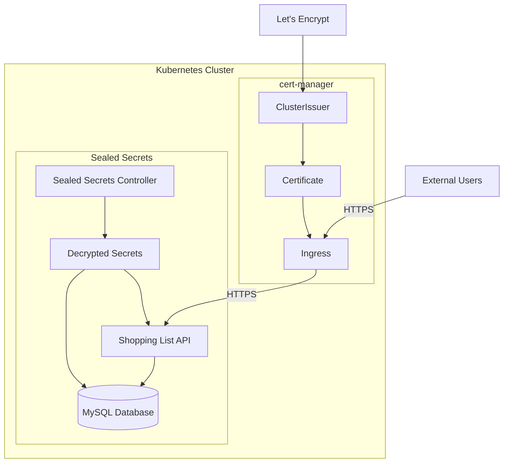

# Shopping List Kubernetes Configuration

This repository contains the Kubernetes configuration for the Shopping List API application.

## HTTPS and Certificate Management

The application uses Let's Encrypt for SSL/TLS certification through cert-manager. The setup includes:

- Automatic TLS certificate provisioning
- HTTP to HTTPS redirection
- Automatic certificate renewal

### Prerequisites for HTTPS

1. cert-manager installed in the cluster
2. A ClusterIssuer named `letsencrypt-prod` configured
3. DNS configured for your domain (e.g., DuckDNS)

### Certificate Status

To check the certificate status:
```bash
kubectl get certificate -n shopping-list-dev
kubectl describe certificate shopping-list-tls -n shopping-list-dev
```

To check the challenge status during certificate issuance:
```bash
kubectl get challenges -n shopping-list-dev
```

If you need to force certificate renewal:
```bash
kubectl delete certificate shopping-list-tls -n shopping-list-dev
```

## Secrets Management

This repository uses Sealed Secrets for managing sensitive information in both development and production environments. The sealed secrets are encrypted using the public key from your cluster's sealed-secrets controller and can only be decrypted by the controller.

### Creating Sealed Secrets

To create a sealed secret:

1. First, create a regular secret manifest:
```yaml
apiVersion: v1
kind: Secret
metadata:
  name: my-secret
  namespace: shopping-list-dev  # or shopping-list-prod
type: Opaque
stringData:
  key: value
```

2. Use kubeseal to encrypt it:
```bash
# For development
kubectl create secret generic my-secret \
  --namespace shopping-list-dev \
  --from-literal=key=value \
  --dry-run=client -o yaml | \
kubeseal --format yaml --scope strict \
  --controller-namespace kube-system \
  --controller-name sealed-secrets \
  > overlays/dev/my-sealed-secret.yaml

# For production
kubectl create secret generic my-secret \
  --namespace shopping-list-prod \
  --from-literal=key=value \
  --dry-run=client -o yaml | \
kubeseal --format yaml --scope strict \
  --controller-namespace kube-system \
  --controller-name sealed-secrets \
  > overlays/prod/my-sealed-secret.yaml
```

3. Add the sealed secret to your kustomization.yaml:
```yaml
resources:
  - my-sealed-secret.yaml
```

### Updating Sealed Secrets

To update a sealed secret:

1. Delete the existing secret from the cluster:
```bash
kubectl delete secret my-secret -n shopping-list-dev  # or shopping-list-prod
```

2. Create and apply a new sealed secret following the steps above.

## Repository Structure

```
.
├── base/                  # Base Kubernetes configurations
│   ├── kustomization.yaml
│   ├── 10-namespace.yaml
│   ├── 20-mysql-secret.yaml
│   ├── 21-api-secret.yaml
│   ├── 30-mysql-pvc.yaml
│   ├── 40-mysql-deployment.yaml
│   ├── 41-mysql-service.yaml
│   ├── 50-api-deployment.yaml
│   ├── 51-api-service.yaml
│   └── 60-api-ingress.yaml
└── overlays/             # Environment-specific configurations
    ├── dev/             # Development environment
    │   ├── kustomization.yaml
    │   ├── namespace.yaml
    │   └── sealed-secrets/
    └── prod/            # Production environment
        ├── kustomization.yaml
        ├── namespace.yaml
        └── sealed-secrets/
```

## Application Architecture



## File Ordering

The files are prefixed with numbers to indicate their deployment order:

- `10-` - Namespace definitions
- `20-` - Secrets and configuration
- `30-` - Storage resources
- `40-` - Database components
- `50-` - Application components
- `60-` - Network components

This ordering ensures that dependencies are created in the correct order (e.g., namespace before resources, secrets before deployments that need them).

## Usage

### Prerequisites

- Kubernetes cluster
- kubectl installed and configured
- kustomize installed (or kubectl version >= 1.14)
- cert-manager installed for HTTPS support

### Deploying to Development

```bash
kubectl apply -k overlays/dev
```

### Deploying to Production

```bash
kubectl apply -k overlays/prod
```

## Configuration

### Secrets

The repository contains example secrets for demonstration. In a real environment:

1. Never commit actual secrets to the repository
2. Use a secure secret management solution (e.g., HashiCorp Vault, Sealed Secrets)
3. Update the secrets according to your environment

### Image Registry

Update the image registry in the overlay kustomization files:

```yaml
images:
  - name: shopping-list-api
    newName: your-registry/shopping-list-api
    newTag: dev  # or prod
```

## Monitoring

The application exposes the following endpoints:
- `/health` - Health check endpoint for kubernetes probes
- HTTPS endpoints (with valid TLS certificate):
  - GET `/items` - List all items
  - POST `/items` - Create a new item
  - PUT `/items/{id}` - Update an item
  - DELETE `/items/{id}` - Delete an item

## Resources

- Development environment uses minimal resources
- Production environment has:
  - Higher replica count (3)
  - More CPU and memory resources
  - Additional monitoring and logging (to be configured)
